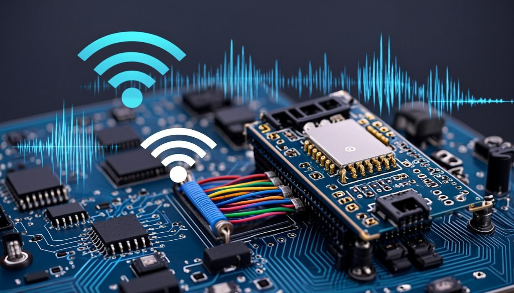

<div align="center">

# 🎤 ESP8266 WiFi Microphone

### High-Fidelity Wireless Audio Streaming from ESP8266 to PC

[](https://opensource.org/licenses/MIT)
[](https://github.com/espressif/ESP8266_RTOS_SDK)
[](https://www.powerbasic.com/)
[]()

**24-bit I2S capture • TPDF dithering • IMA ADPCM / PCM • UDP / TCP / Raw 802.11 TX • Real-time playback • WAV recording**

*Developed in collaboration with AI (Z.ai Code)*

</div>

---

## ✨ Features

<table>
<tr>
<td width="50%" valign="top">

### 🎙️ Professional Audio Pipeline
- **24-bit I2S capture** with INMP441 MEMS microphone
- **TPDF dithering** (Wannamaker/Vanderkooy/Lipshitz) for 24→16-bit reduction
- **Software AGC** with 9 presets (Studio→Surveillance), per-preset attack/release/target/noise gate
- **Fixed digital gain** (0–64×, +0 to +36 dB)
- **IRAM-optimized** ADPCM encoder (zero flash cache stalls)
- **DMA alignment fix** — zero-click audio on all sample rates (8–48 kHz)
- **I2S RX timing delays** (`AT+TIMING`) for skew compensation on long wires

</td>
<td width="50%" valign="top">

### 📡 Triple Transport Modes
- **UDP Mode**: Standard WiFi via router, 5+ Mbps throughput
- **TCP Mode**: ESP = listener, server connects. Length-prefix framing,
  guaranteed delivery, blocking send with backpressure. Persistent
  listening socket across stop→start cycles (no EADDRINUSE)
- **Raw 802.11 TX Mode**: Broadcast directly to Monitor Mode receiver
  - No router needed, fixed 11 Mbps TX rate (802.11b)
  - Sequence-numbered frames with auto-increment

Switchable at runtime via `AT+XPORT=0|1|2` + `AT+HOTRESTART`

</td>
</tr>
<tr>
<td width="50%" valign="top">

### 🎵 Dual Codec Support
- **IMA ADPCM** (DVI4/RFC 3551): 4 bits/sample, ~32 kbps at 16kHz
  - RFC 3551 nibble packing (high nibble first)
  - Per-channel DVI4 header with predictor + step index
- **Raw PCM**: 16-bit or 24-bit signed, little-endian
  - 24-bit PCM passes through bit-perfect
  - Stereo interleaved

</td>
<td width="50%" valign="top">

### 🔄 On-the-Fly Format Switching
- Change sample rate, channels, bit depth, codec, transport **without rebooting**
- `AT+HOTRESTART` restarts the stream pipeline in ~200ms
- Transport switch (UDP↔TCP↔RawTX) with automatic old-transport cleanup
- Receiver **auto-detects** format change from packet header
- Reopens WaveOut with new format seamlessly
- Resets ADPCM decoder state on codec change

</td>
</tr>
<tr>
<td width="50%" valign="top">

### 🎛️ Full AT Command Interface
- Configure everything over UART (115200 baud)
- All settings persist in NVS flash
- `AT+HOTRESTART` applies audio + transport changes instantly
- `AT+XPORT` — switch transport (UDP/TCP/RawTX)
- `AT+AGC` — 9 AGC presets (Studio→Surveillance)
- `AT+TIMING` — I2S RX input delays (sd/ws/bck, 0–3 each)
- `AT+HOST` — DHCP hostname (max 23 chars, shown in receiver UI)
- No reboot needed for audio parameter changes

</td>
<td width="50%" valign="top">

### 💻 Windows Receiver (EASSP Server)
- **Multi-device**: Stream from up to 16 ESP8266s simultaneously
- **Auto-discovery**: UDP broadcast on port 3950
- **Device names**: Shows `hostname (MAC)` in ListView — identify devices at a glance
- **Per-device output**: Right-click any device → "Output Device" submenu →
  route each microphone to a different WaveOut device (speakers, VB-Cable, etc.)
  for independent use in Discord, Zoom, OBS simultaneously
- **Virtual microphone support**: Select VB-Cable as output → audio appears as
  a virtual microphone in any application (Discord, Zoom, OBS, Teams, browsers)
- **Context menu**: Right-click ListView for Start/Stop, Select All / Clear All,
  per-device output selection, and Stop All Streams
- **Transport auto-detect**: Reads `transport_mode` from INFO payload,
  opens UDP socket or TCP connection automatically
- **Clock drift fix**: WaveOut opens at ESP's actual I2S rate (e.g. 43860 Hz
  for nominal 44100) — no underruns, no clicks
- **WAV recording**: 1 GB auto-split, correct headers for all formats
- **24-bit playback**: Native WaveOut, auto-fallback to 16-bit
- **Real-time stats**: RSSI, heap, packet loss, duration
- **Multi-part status bar**: Devices count, streaming count, UDP port, output device

</td>
</tr>
</table>

---

## 📸 Social Preview



---

## 🏗️ Architecture

```
                    ESP8266 Firmware
 ┌─────────────────────────────────────────────────────────┐
 │                                                         │
 │  INMP441 ──I2S──> TPDF Dither ──> ADPCM/PCM ──> WiFi  │
 │   24-bit           24→16 bit       Encode        TX    │
 │   capture          dither          DVI4/PCM            │
 │                                                         │
 │  ┌──────────┐  ┌───────────┐  ┌──────────┐             │
 │  │ I2S Task │->│ Enc Task  │->│ TX Task  │             │
 │  │ prio: 5  │  │ prio: 3   │  │ prio: 2  │             │
 │  └──────────┘  └───────────┘  └──────────┘             │
 │       │              │              │                   │
 │  Gain/AGC       ADPCM nibbles   transport_send()       │
 │  TPDF dither    or PCM copy     (vtable dispatch)      │
 │  I2S timing                     ┌─────┬─────┬───────┐  │
 │                                 │ UDP │ TCP │ RawTX │  │
 │                                 └─────┴─────┴───────┘  │
 └─────────────────────────────────────────────────────────┘
                          │
            ┌─────────────┼─────────────┐
            ▼             ▼             ▼
         UDP socket   TCP listener   Raw 802.11
         (datagram)   (framing)      (broadcast)
            │             │             │
            └─────────────┼─────────────┘
                          ▼
                    Windows Receiver
 ┌─────────────────────────────────────────────────────────┐
 │                                                         │
 │  Transport RECV ──> Header Parse ──> ADPCM Decode ──>  │
 │  (UDP/TCP)           or PCM copy    WaveOut Playback   │
 │                                 │                       │
 │                          Format Change?                 │
 │                           ├── Yes -> Reopen WaveOut     │
 │                           └── No  -> Continue           │
 │                                                         │
 │  + Clock drift fix (EspActualRate → 43860 Hz)          │
 │  + WAV Recording (1 GB auto-split)                     │
 │  + ListView with live device stats                     │
 │  + Multi-device simultaneous streaming                 │
 │  + TCP reconnect on disconnect                         │
 │                                                         │
 └─────────────────────────────────────────────────────────┘
```

---

## 🔧 Hardware

### Bill of Materials

| Component | Purpose | Price |
|-----------|---------|-------|
| ESP8266 (ESP-12F / NodeMCU / Wemos D1) | Microcontroller + WiFi | ~$3 |
| INMP441 I2S MEMS microphone | Audio capture (24-bit) | ~$2 |
| USB-to-UART adapter | Flashing + AT commands | ~$2 |

### Wiring Diagram

```
 ┌──────────────┐              ┌──────────────┐
 │   INMP441    │              │    ESP8266   │
 │              │              │              │
 │  VDD ────────┼──────────────┼─ 3.3V        │
 │  GND ────────┼──────────────┼─ GND         │
 │  SCK ────────┼──────────────┼─ GPIO13      │
 │  WS  ────────┼──────────────┼─ GPIO14      │
 │  SD  ────────┼──────────────┼─ GPIO12      │
 │  L/R ────────┼──────────────┼─ GND (left)  │
 │              │              │              │
 └──────────────┘              └──────────────┘
```

> ⚠️ **Note**: Add a 100kΩ pulldown resistor on GPIO12 (INMP441 SD line) to ensure correct boot mode.

> 💡 **Tip**: Place a 0.1µF ceramic capacitor between INMP441 VDD and GND, as close to the microphone as possible.

---

## 🚀 Quick Start

### 1. Build & Flash Firmware

We recommend using [ESP8266-IDF](https://github.com/Dzantemir/ESP8266-IDF) Docker build environment:

```bash
# Clone build environment
git clone https://github.com/Dzantemir/ESP8266-IDF.git
cd ESP8266-IDF

# Clone this project
git clone https://github.com/yourname/esp8266-wifi-microphone.git projects/esp8266-wifi-microphone

# Build
docker-compose run --rm esp8266 bash -c "
  cd /projects/esp8266-wifi-microphone/firmware &&
  export IDF_PATH=/opt/esp8266-rtos-sdk &&
  cp i2s.c \$IDF_PATH/components/esp8266/driver/i2s.c &&
  idf.py build
"

# Flash
docker-compose run --rm esp8266 --device /dev/ttyUSB0 bash -c "
  cd /projects/esp8266-wifi-microphone/firmware &&
  export IDF_PATH=/opt/esp8266-rtos-sdk &&
  idf.py -p /dev/ttyUSB0 flash
"
```

<details>
<summary>📖 Manual build (without Docker)</summary>

```bash
# Install ESP8266 RTOS SDK v3.4
git clone --recursive https://github.com/espressif/ESP8266_RTOS_SDK.git
cd ESP8266_RTOS_SDK && git checkout release/v3.4

# Install toolchain: xtensa-lx106-elf (GCC 8.4.0)

# Copy patched I2S driver (REPLACE the SDK file)
cp firmware/i2s.c $IDF_PATH/components/esp8266/driver/i2s.c

# Build
cd firmware
export IDF_PATH=/path/to/ESP8266_RTOS_SDK
idf.py build
idf.py flash monitor
```

</details>

### 2. Configure WiFi & Transport

Connect to ESP8266 UART (115200 baud) and send:

```
AT+WIFI=YourWiFiSSID,YourWiFiPassword
AT+RATE=48000
AT+BITS=24
AT+AGC=3              # 0=OFF 1=Studio 2=Podcast 3=Balanced 4=Fast 5=Noisy 6=Music 7=Limiter 8=Surveillance
AT+XPORT=0          # 0=UDP (default), 1=TCP, 2=Raw 802.11 TX
AT+HOTRESTART       # Apply changes without reboot
```

### 3. Start the Receiver

Run `eassp_server.exe` on your Windows PC. The ESP8266 appears automatically:

1. ✅ Check the checkbox next to the device
2. ▶️ Click **Start Stream**
3. 🔊 Audio plays through your speakers!

The receiver auto-detects the transport mode from the device's INFO packet and
opens a UDP socket or TCP connection accordingly.

**Right-click** the ListView for a context menu:
- **Start Stream / Stop Stream** — for checked devices
- **Output Device ▶** — route this microphone to a specific WaveOut device
- **Select All / Clear All** — batch checkbox operations
- **Stop All Streams** — stop everything

### 4. Virtual Microphone (Optional — use in Discord/Zoom/OBS)

To route the ESP8266 audio into any application as a virtual microphone:

1. Download and install **VB-Cable** from [vb-audio.com/Cable](https://vb-audio.com/Cable/) (free)
2. In EASSP Server: right-click the device → **Output Device** → **CABLE Input**
   (or select it from the "Output:" dropdown at the top)
3. In Discord/Zoom/OBS: select **CABLE Output** as your microphone
4. Audio from ESP8266 now appears as a microphone input!

For multiple microphones: install multiple VB-Cable instances (A, B, C...) and
route each ESP8266 to a different cable. Each appears as a separate microphone.

### 5. Record (Optional)

Click **DUMP** to record to WAV. Files auto-split at 1 GB:
- `dump_153000_1.wav` — first gigabyte
- `dump_153000_2.wav` — second gigabyte
- ...

---

## ⌨️ AT Command Reference

| Command | Description | Example |
|---------|-------------|---------|
| `AT` | Check connection | `AT` |
| `AT+RST` | Reboot device | `AT+RST` |
| `AT+STATUS` | Full device status | `AT+STATUS` |
| `AT+WIFI=ssid,pass` | Set WiFi credentials | `AT+WIFI=MyHome,secret123` |
| `AT+HOST=name` | Set DHCP hostname (max 23 chars) | `AT+HOST=esp-mic` |
| `AT+PORT=n` | Service/discovery port | `AT+PORT=3950` |
| `AT+TXPWR=n` | WiFi TX power (dBm, 0-20) | `AT+TXPWR=20` |
| `AT+RATE=n` | Sample rate (Hz) | `AT+RATE=48000` |
| `AT+BITS=n` | Bit depth (16 or 24) | `AT+BITS=24` |
| `AT+CH=n` | Channel: 0=L, 1=R, 2=stereo | `AT+CH=0` |
| `AT+CODEC=n` | 0=ADPCM, 1=PCM | `AT+CODEC=0` |
| `AT+AGC=n` | AGC preset 0-8 (see below) | `AT+AGC=3` |
| `AT+GAIN=n` | Fixed gain 0-64 (0=bypass) | `AT+GAIN=32` |
| `AT+FMT=n` | 0=Philips I2S, 1=LSB | `AT+FMT=0` |
| `AT+XPORT=n` | Transport: 0=UDP, 1=TCP, 2=RawTX | `AT+XPORT=1` |
| `AT+WCH=n` | WiFi channel 1-13 (RawTX only) | `AT+WCH=6` |
| `AT+TIMING=sd,ws,bck` | I2S RX input delays (0-3 each) | `AT+TIMING=0,1,0` |
| `AT+HOTRESTART` | Restart stream (apply changes) | `AT+HOTRESTART` |
| `AT+FACTORY` | Factory reset | `AT+FACTORY` |
| `AT+HELP` | Show all commands | `AT+HELP` |

---

## 🎛️ AGC Presets

9 presets selectable via `AT+AGC=0..8` or menuconfig:

| # | Name | Attack | Release | Target | Character |
|---|------|:------:|:-------:|:------:|-----------|
| 0 | OFF | — | — | — | Bypass (use fixed gain via AT+GAIN) |
| 1 | Studio Soft | 30 | 5 | -18 dBFS | Very smooth, minimal pumping |
| 2 | Podcast | 50 | 15 | -18 dBFS | Smooth voice control |
| 3 | Voice Balanced | 75 | 20 | -18 dBFS | Default, good for speech |
| 4 | Voice Fast | 90 | 40 | -18 dBFS | Fast reaction for dynamic speech |
| 5 | Noisy Room | 60 | 25 | -15 dBFS | High noise gate, cuts background |
| 6 | Music | 15 | 60 | -12 dBFS | Slow attack (no transient squash), fast release |
| 7 | Limiter | 100 | 5 | -6 dBFS | Peak limiting only, no quiet boost |
| 8 | Surveillance | 95 | 80 | -12 dBFS | Aggressive, constant level for monitoring |

**Attack** = speed of gain DROP when signal is loud (% per frame, higher = faster)
**Release** = speed of gain RISE when signal is quiet (% per frame, higher = faster)
**Target** = desired output level in dBFS (lower = more headroom)
**Noise gate** = below this level, gain is frozen at 1× (prevents noise amplification)

---

## 🎵 Audio Quality

This project prioritizes audio quality at every stage:

<details>
<summary>🔬 Detailed quality analysis</summary>

### Capture Stage
| Parameter | Value |
|-----------|-------|
| Microphone | INMP441 (24-bit I2S MEMS) |
| SNR | 61 dB SPL |
| Sensitivity | -26 dBFS @ 94 dB SPL |
| Bit depth | 24-bit (configurable to 16-bit) |
| Sample rates | 8, 11.025, 16, 22.05, 32, 44.1, 48 kHz |

### Processing Stage
| Technique | Purpose |
|-----------|---------|
| TPDF Dithering | Linearizes quantizer, decorrelates error (24→16 bit) |
| AGC | 9 presets with per-preset attack/release/target/noise gate |
| Gain Smoothing | Prevents zipper noise on gain changes |
| IRAM Encoder | Zero flash cache stalls during WiFi SPI operations |
| DMA Alignment | `samples_per_frame &= ~7` — eliminates SLC word-boundary artifacts |
| I2S RX Timing | `AT+TIMING` — programmable input delays for skew compensation |

### DMA Alignment Fix

ESP8266 SLC (DMA) transfers data in 32-bit words. If `blocksize` (= `dma_buf_len ×
sample_size`) is not a multiple of 4, the SLC handoff at descriptor boundaries loses
or duplicates one sample per buffer — audible as periodic clicks at
`sample_rate / dma_buf_len` Hz.

The fix aligns `samples_per_frame` to a multiple of 8 (16-bit) or 4 (24-bit) in
`main.c`, ensuring `blocksize ≡ 0 (mod 4)` and `want ≡ 0 (mod buf_size)` — zero
clicks on all sample rates (8–48 kHz), both codecs (ADPCM and PCM).

### ADPCM Details
- IMA ADPCM (DVI4 / RFC 3551)
- 4 bits per sample (8:1 compression vs 16-bit PCM)
- Per-channel DVI4 header (predictor + step index)
- Step table: 89 entries, index table: 16 entries
- Encoder hot path in IRAM for deterministic timing

### PCM Details
- 16-bit: 2 bytes/sample, direct passthrough
- 24-bit: 3 bytes/sample (low 3 bytes of int32), bit-perfect
- Stereo: interleaved L/R/L/R
- No compression artifacts

### Clock Drift Fix (Receiver)

ESP8266 I2S uses integer clock dividers from 160 MHz. At 44100 Hz, the actual
capture rate is 43860 Hz (−0.545%). If the receiver opens WaveOut at the nominal
44100 Hz, the playback buffer drains faster than ESP fills it → underruns →
periodic clicks in live mode.

The receiver's `EspActualRate()` function mirrors the firmware's `i2s_set_rate()`
divider search and opens WaveOut at the actual rate (43860 Hz). The Windows audio
engine handles the final resample to the sound card's native rate.

</details>

---

## 📡 Protocol

<details>
<summary>📋 EASSP Protocol Specification</summary>

### Service Port (UDP 3950)

| Command | Code | Direction | Description |
|---------|------|-----------|-------------|
| DISCOVER | 0x01 | Server→Device | Heartbeat / discovery |
| CONFIGURE | 0x02 | Server→Device | Start streaming to port |
| STOP | 0x03 | Server→Device | Stop streaming immediately |
| INFO | 0x81 | Device→Server | Status response |

### INFO Payload (58 bytes, v2.2)

```
Offset  Field             Type     Description
0       status            u8       0=IDLE, 1=STREAMING, 2=ERROR
1       codec_id          u8       5=ADPCM, 6=PCM
2       error             u8       Error code (0=none)
3       channels          u8       1=mono, 2=stereo
4       sample_rate       u32      Hz (e.g., 44100)
8       frame_ms          u8       Frame duration in ms
9       mac[6]            u8[6]    Device MAC address
15      packets_sent      u32      Since stream start
19      free_heap         u32      Current free heap
23      wifi_rssi         i8       dBm (sign-extended)
24      firmware[8]       char[8]  Firmware version
32      bits_per_sample   u8       16 or 24
33      transport_mode    u8       v2.1: 0=UDP, 1=TCP, 2=Raw 802.11 TX
34      hostname[24]      char[24] v2.2: DHCP hostname (NUL-terminated, max 23 chars)
```

### Audio Packet Header (16 bytes)

```
Offset  Field           Type     Description
0       seq_num         u16      Sequence number (wraps at 65535)
2       timestamp_ms    u32      Frame timestamp in milliseconds
6       codec           u8       5=ADPCM, 6=PCM
7       sample_rate     u8       Enum: 0=8k..6=48k
8       channels        u8       1=mono, 2=stereo
9       frame_ms        u8       Frame duration in ms
10      bitrate         u32      Audio bitrate in bps
14      bits            u16      Bits per sample (16 or 24)
```

### TCP Framing

TCP is a stream protocol (no message boundaries). Each audio frame is prefixed
with a 2-byte big-endian length:

```
[u16 length BE][16-byte pkt_header][payload]
 length = 16 + payload_len (≤ 1416, fits in u16)
```

The receiver reads 2 bytes (length), then reads `length` bytes (frame). This
preserves frame boundaries over TCP.

### On-the-Fly Format Switching

When ESP8266 changes format via `AT+HOTRESTART`:
1. Receiver detects changed fields in packet header
2. Closes WaveOut → Opens new WaveOut with new format
3. Resets ADPCM decoder state
4. Continues playing — no user intervention needed

</details>

---

## 🏗️ Transport Architecture

The firmware uses a **vtable pattern** (`stream_mode_ops_t`) to abstract transport
differences. Three independent transport modules, one common pipeline:

```
                    Common Pipeline (main.c)
                    ┌──────────────────────────┐
  I2S capture  ───> │ i2s_task_fn              │
                    │   ↓ (PCM frames)          │
  ADPCM/PCM    ───> │ adpcm_task_fn/pcm_task_fn │
                    │   ↓ (encoded frames)      │
  Send         ───> │ stream_task_fn            │
                    │   ↓ transport_send()       │  ← vtable dispatch
                    └──────────┬──────────────────┘
                               │
              ┌────────────────┼────────────────┐
              ▼                ▼                ▼
         ┌─────────┐     ┌──────────┐     ┌───────────┐
         │ UDP     │     │ TCP      │     │ RawTX     │
         │ socket  │     │ listener │     │ 802.11 TX │
         │         │     │ +framing │     │ broadcast │
         └─────────┘     └──────────┘     └───────────┘
         udp_stream.c    tcp_stream.c     rawtx_stream.c
```

Each transport module is **fully independent** — own state, own header file,
no shared variables, no `if (transport == ...)` branches. Adding a 4th transport
requires only a new `.c` file + one entry in `stream_mode.c`.

---

## 📁 Project Structure

```
esp8266-wifi-microphone/
├── README.md                      # You are here
├── LICENSE                        # MIT
├── social_preview.png             # GitHub social preview image
├── SOLUTION.md                    # Audio fix documentation (DMA alignment, drift)
│
├── firmware/                      # ESP8266 firmware (ESP8266 RTOS SDK v3.4)
│   ├── CMakeLists.txt
│   ├── sdkconfig                  # Build configuration (LWIP_SO_REUSE=y, TCP buffers)
│   ├── i2s.c                      # Patched I2S driver (REPLACE in SDK)
│   └── main/
│       ├── CMakeLists.txt
│       ├── Kconfig.projbuild      # menuconfig options (transport, timing, tasks)
│       ├── main.c                 # Main app + pipeline tasks + transport switch
│       ├── stream_mode.c          # Transport vtable (UDP/TCP/RawTX ops tables)
│       ├── wifi_sta.c             # WiFi STA + Raw TX + fixed rate
│       ├── udp_stream.c           # UDP socket transport (independent)
│       ├── tcp_stream.c           # TCP listener + framing + backpressure
│       ├── rawtx_stream.c         # Raw 802.11 TX transport (independent)
│       ├── at_cmd.c               # AT command interface
│       ├── config_mgr.c           # NVS configuration manager
│       ├── svc_port.c             # EASSP service port
│       ├── i2s_capture.c          # I2S capture + AGC + gain + timing delays
│       ├── adpcm_encoder.c        # IMA ADPCM encoder (IRAM)
│       ├── tpdf_dither.c          # TPDF dithering
│       ├── battery.c              # Battery monitoring (optional)
│       └── include/               # Header files
│           ├── stream_mode.h      # Transport ops vtable + wrappers
│           ├── udp_stream.h       # UDP transport API
│           ├── tcp_stream.h       # TCP transport API
│           ├── rawtx_stream.h     # RawTX transport API
│           ├── board_config.h     # Config defaults + TRANSPORT_MODE_* + TCP_*
│           ├── config_mgr.h       # device_config_t + setters
│           ├── svc_protocol.h     # EASSP protocol (INFO v2.2, 58 bytes)
│           ├── packet_format.h    # Audio packet header (16 bytes)
│           └── ...                # Other headers
│
├── server/                        # Windows receiver (PowerBASIC 10)
│   ├── eassp_server.bas           # Main app (UDP+TCP, drift fix, per-device output, context menu)
│   ├── config.inc                 # Constants + control IDs + menu IDs
│   └── types.inc                  # DeviceInfo (dwTransport, sHostname, dwWaveDevice)
│
├── patches/                       # Documentation of applied fixes
│   ├── README.md                  # Patch guide
│   ├── firmware_frame_ms_mod4.patch  # DMA alignment fix (applied in code)
│   ├── receiver_patch.bas         # Clock drift fix (applied in code)
│   ├── asrc_alternative.bas       # ASRC alternative (not applied)
│   └── firmware_optional_status.patch  # Diagnostic (not applied)
│
└── docs/
    ├── wiring.md                  # Hardware wiring guide
    └── protocol.md                # Protocol specification
```

---

## ⚙️ menuconfig Options

Key configuration options (via `idf.py menuconfig` → ADPCM Streamer Configuration):

| Menu | Option | Default | Description |
|------|--------|:-------:|-------------|
| **Audio transport mode** | `STREAMER_TRANSPORT_MODE` | UDP | UDP / TCP / Raw 802.11 TX |
| **Audio** | `STREAMER_SAMPLE_RATE` | 16000 | 8k–48k |
| | `STREAMER_I2S_BITS_PER_SAMPLE` | 24 | 16 or 24 |
| | `STREAMER_AUDIO_CODEC` | ADPCM | ADPCM or PCM |
| | `STREAMER_AUDIO_GAIN` | 32 | 0–64 (0=bypass) |
| | `STREAMER_AGC_MODE` | Voice Balanced | 9 presets (OFF→Surveillance) |
| **I2S Timing** | `STREAMER_I2S_TIMING_SD_DELAY` | 0 | RX SD delay (0–3) |
| | `STREAMER_I2S_TIMING_WS_DELAY` | 0 | RX WS delay (0–3) |
| | `STREAMER_I2S_TIMING_BCK_DELAY` | 0 | RX BCK delay (0–3) |
| | `STREAMER_RAWTX_CHANNEL` | 1 | WiFi channel 1–13 (RawTX only) |
| **Pipeline & Tasks** | `STREAMER_TASK_PRIO_TCP_ACCEPT` | 4 | TCP accept task priority |
| | `STREAMER_TCP_ACCEPT_TASK_STACK` | 1024 | TCP accept task stack |
| | `STREAMER_TASK_PRIO_I2S` | 5 | I2S capture task priority |
| | `STREAMER_TASK_PRIO_ADPCM` | 3 | Encoder task priority |
| | `STREAMER_TASK_PRIO_UDP` | 2 | Sender task priority |
| **Network / UDP** | `STREAMER_UDP_SEND_TIMEOUT_MS` | 100 | UDP send timeout |
| | `STREAMER_TCP_SEND_TIMEOUT_MS` | 2000 | TCP send timeout (ms) |

> **Important**: `CONFIG_LWIP_SO_REUSE=y` must be set in sdkconfig (Component config →
> LWIP → Enable SO_REUSEADDR option) for TCP transport to work across stop→start cycles.

---

## 🙏 Acknowledgments

- **Espressif** — ESP8266 RTOS SDK
- **PowerBASIC** — Windows application development
- **Z.ai Code** — AI-assisted development
- **INMP441** — High-quality I2S MEMS microphone

---

## 📄 License

MIT License — see [LICENSE](LICENSE) for details.

---

<div align="center">

**⭐ Star this project if you find it useful!**

Made with ❤️ and AI

</div>
