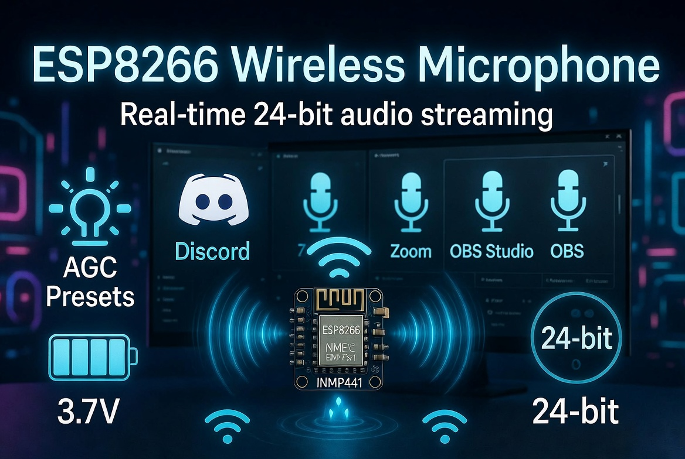
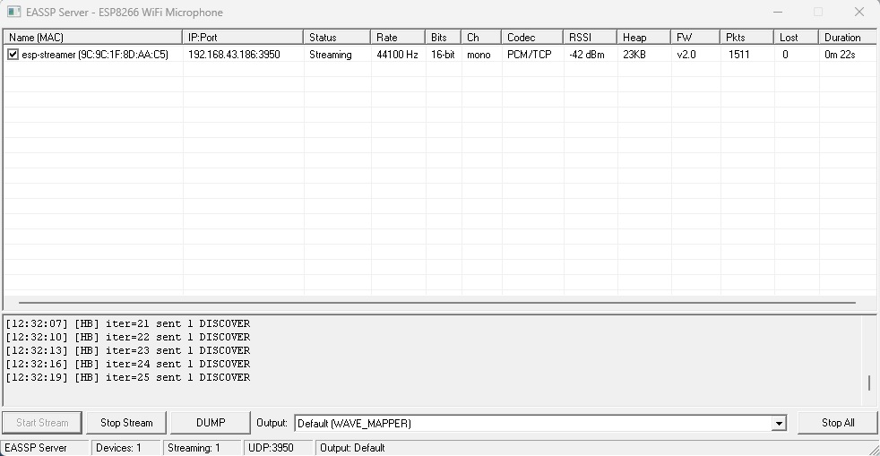

<div align="center">

# 🎤 ESP8266 WiFi Microphone

### High-Fidelity Wireless Audio Streaming from ESP8266 to PC

[](https://opensource.org/licenses/MIT)
[](https://github.com/espressif/ESP8266_RTOS_SDK)
[](https://www.powerbasic.com/)
[]()

**24-bit I2S capture • TPDF dithering • IMA ADPCM / PCM • UDP / TCP / Raw 802.11 TX • Real-time playback • WAV recording • Supervisor watchdog • Deep sleep recovery**

</div>

---

## ✨ Features

<table>
<tr>
<td width="50%" valign="top">

### 🎙️ Professional Audio Pipeline
- **24-bit I2S capture** with INMP441 MEMS microphone
- **TPDF dithering** (Wannamaker/Vanderkooy/Lipshitz) for 24→16-bit reduction
- **Software AGC** with 9 presets (Studio→Surveillance), per-preset attack/release/target/noise gate
- **Fixed digital gain** (0–64×, +0 to +36 dB)
- **IRAM-optimized** ADPCM encoder (zero flash cache stalls)
- **DMA alignment fix** — zero-click audio on all sample rates (8–48 kHz)
- **I2S RX timing delays** (`AT+TIMING`) for skew compensation on long wires

</td>
<td width="50%" valign="top">

### 📡 Triple Transport Modes
- **UDP Mode**: Standard WiFi via router, 5+ Mbps throughput
- **TCP Mode**: ESP = listener, server connects. Length-prefix framing,
  guaranteed delivery, blocking send with backpressure. Persistent
  listening socket across stop→start cycles (no EADDRINUSE).
  Configurable via menuconfig: TCP_NODELAY, keepalive (idle/interval/count),
  SO_LINGER=0 (skip TIME_WAIT, prevent heap exhaustion)
- **Raw 802.11 TX Mode**: Broadcast directly to Monitor Mode receiver
  - No router needed, fixed 11 Mbps TX rate (802.11b)
  - Sequence-numbered frames with auto-increment

Switchable at runtime via `AT+XPORT=0|1|2` + `AT+HOTRESTART`

</td>
</tr>
<tr>
<td width="50%" valign="top">

### 🎵 Dual Codec Support
- **IMA ADPCM** (DVI4/RFC 3551): 4 bits/sample, ~32 kbps at 16kHz
  - RFC 3551 nibble packing (high nibble first)
  - Per-channel DVI4 header with predictor + step index
- **Raw PCM**: 16-bit or 24-bit signed, little-endian
  - 24-bit PCM passes through bit-perfect
  - Stereo interleaved

</td>
<td width="50%" valign="top">

### 🔄 On-the-Fly Format Switching
- Change sample rate, channels, bit depth, codec, transport **without rebooting**
- `AT+HOTRESTART` restarts the stream pipeline in ~200ms
- Transport switch (UDP↔TCP↔RawTX) with automatic old-transport cleanup
- Receiver **auto-detects** format change from packet header
- Reopens WaveOut with new format seamlessly
- Resets ADPCM decoder state on codec change

</td>
</tr>
<tr>
<td width="50%" valign="top">

### 🛡️ Reliability & Auto-Recovery
- **Supervisor task** (software watchdog): monitors heap, pipeline liveness
  (I2S/TX frame counters), and stack high-water marks. If anything goes
  wrong → instant `esp_restart()`. Catches "soft" deadlocks the HW WDT
  can't see (tasks yield but do no work)
- **WiFi boot retry + deep sleep**: on boot, tries AP connection N times.
  If all fail → deep sleep 1–2 min → reboot → retry. Prevents zombie
  state when AP is unreachable (power outage, out of range)
- **TCP reconnect leak fix**: `tcp_stream_init_listen()` no longer kills
  valid pre-connected clients. Eliminates TIME_WAIT heap exhaustion
  (-24KB per 3-4 stop+start cycles)
- **SO_LINGER=0** on TCP client sockets: RST close skips TIME_WAIT entirely
- **Sleep/wake recovery**: receiver detects PC sleep/wake, forces
  CONFIGURE resend + TCP reconnect + WaveOut reopen. Survives 15+ min sleep
- **Burst-submit prebuffer**: jitter buffer accumulates frames without
  draining, then burst-submits all at once — eliminates startup underrun clicks

</td>
<td width="50%" valign="top">

### 🎛️ Full AT Command Interface
- Configure everything over UART (115200 baud)
- All settings persist in NVS flash
- `AT+HOTRESTART` applies audio + transport changes instantly
- `AT+XPORT` — switch transport (UDP/TCP/RawTX)
- `AT+AGC` — 9 AGC presets (Studio→Surveillance)
- `AT+TIMING` — I2S RX input delays (sd/ws/bck, 0–3 each)
- `AT+HOST` — DHCP hostname (max 23 chars, shown in receiver UI)
- No reboot needed for audio parameter changes

</td>
</tr>
<tr>
<td width="100%" valign="top" colspan="2">

### 💻 Windows Receiver (EASSP Server)
- **Multi-device**: Stream from up to 16 ESP8266s simultaneously
- **Auto-discovery**: UDP broadcast on port 3950
- **Device names**: Shows `hostname (MAC)` in ListView — identify devices at a glance
- **Per-device output**: Right-click any device → "Output Device" submenu →
  route each microphone to a different WaveOut device (speakers, VB-Cable, etc.)
  for independent use in Discord, Zoom, OBS simultaneously
- **Virtual microphone support**: Select VB-Cable as output → audio appears as
  a virtual microphone in any application (Discord, Zoom, OBS, Teams, browsers)
- **Context menu**: Right-click ListView for Start/Stop, Select All / Clear All,
  per-device output selection, and Stop All Streams
- **Transport auto-detect**: Reads `transport_mode` from INFO payload,
  opens UDP socket or TCP connection automatically
- **Clock drift fix**: WaveOut opens at ESP's actual I2S rate (e.g. 43860 Hz
  for nominal 44100) — no underruns, no clicks
- **WAV recording**: 1 GB auto-split, correct headers for all formats
- **24-bit playback**: Native WaveOut, auto-fallback to 16-bit
- **Real-time stats**: RSSI, heap, packet loss, duration
- **Multi-part status bar**: Devices count, streaming count, UDP port, output device

</td>
</tr>
</table>

---

## 📸 Social Preview



## 🖥️ EASSP Server (Windows Receiver)



---

## 🏗️ Architecture

```
                    ESP8266 Firmware
 ┌─────────────────────────────────────────────────────────┐
 │                                                         │
 │  INMP441 ──I2S──> TPDF Dither ──> ADPCM/PCM ──> WiFi  │
 │   24-bit           24→16 bit       Encode        TX    │
 │   capture          dither          DVI4/PCM            │
 │                                                         │
 │  ┌──────────┐  ┌───────────┐  ┌──────────┐             │
 │  │ I2S Task │->│ Enc Task  │->│ TX Task  │             │
 │  │ prio: 5  │  │ prio: 3   │  │ prio: 2  │             │
 │  └────┬─────┘  └─────┬─────┘  └────┬─────┘             │
 │       │              │              │                   │
 │  Gain/AGC       ADPCM nibbles   transport_send()       │
 │  TPDF dither    or PCM copy     (vtable dispatch)      │
 │  I2S timing                     ┌─────┬─────┬───────┐  │
 │                                 │ UDP │ TCP │ RawTX │  │
 │                                 └─────┴─────┴───────┘  │
 │                                                         │
 │  ┌──────────────────────────────────────────────────┐  │
 │  │ Supervisor Task (prio: 1 — software watchdog)   │  │
 │  │   • Heap < 15KB? → esp_restart()               │  │
 │  │   • Pipeline stalled 15s? → esp_restart()      │  │
 │  │   • Stack < 256B? → esp_restart()              │  │
 │  └──────────────────────────────────────────────────┘  │
 │  ┌──────────────────────────────────────────────────┐  │
 │  │ WiFi Boot Retry (on startup)                    │  │
 │  │   • Try AP ×3 → deep sleep 2 min → reboot       │  │
 │  └──────────────────────────────────────────────────┘  │
 └─────────────────────────────────────────────────────────┘
                          │
            ┌─────────────┼─────────────┐
            ▼             ▼             ▼
         UDP socket   TCP listener   Raw 802.11
         (datagram)   (framing)      (broadcast)
            │             │             │
            └─────────────┼─────────────┘
                          ▼
                    Windows Receiver
 ┌─────────────────────────────────────────────────────────┐
 │                                                         │
 │  Transport RECV ──> Header Parse ──> ADPCM Decode ──>  │
 │  (UDP/TCP)           or PCM copy    WaveOut Playback   │
 │                                 │                       │
 │                          Format Change?                 │
 │                           ├── Yes -> Reopen WaveOut     │
 │                           └── No  -> Continue           │
 │                                                         │
 │  + Burst-submit prebuffer (click-free startup)         │
 │  + Overflow vs underrun distinction (no false clicks)  │
 │  + Clock drift fix (EspActualRate → 43860 Hz)          │
 │  + WAV Recording (1 GB auto-split)                     │
 │  + ListView with live device stats                     │
 │  + Multi-device simultaneous streaming                 │
 │  + TCP reconnect on disconnect                         │
 │  + Sleep/wake recovery (CONFIGURE + TCP + WaveOut)     │
 │                                                         │
 └─────────────────────────────────────────────────────────┘
```

---

## 🔧 Hardware

### Bill of Materials

| Component | Purpose | Price |
|-----------|---------|-------|
| ESP8266 / ESP8285 (ESP-12F, ESP-12S, NodeMCU, Wemos D1, ESP-07S) | Microcontroller + WiFi | ~$2–4 |
| INMP441 I2S MEMS microphone module | 24-bit audio capture | ~$1–2 |
| USB-to-UART adapter (CP2102 / CH340) | Flashing + AT commands | ~$1–2 |

> **ESP8285**: This project is fully compatible with the ESP8285 — it's an
> ESP8266 with integrated 1 MB flash in a single chip. Any ESP8285-based module
> (e.g., ESP-M1, ESP-M2, WROOM-02) works without modifications.

### Alternative I2S MEMS Microphones

The project is designed for the INMP441 but works with any I2S MEMS microphone
that supports **Philips I2S** (MSB-first) or **LSB-justified** format. Configure
via `AT+FMT=0` (Philips) or `AT+FMT=1` (LSB).

| Microphone | Bits | Format | Notes |
|------------|:----:|--------|-------|
| **INMP441** | 24-bit | Philips I2S | Default, recommended. Best SNR (61 dB). |
| **ICS-43434** | 24-bit | Philips I2S | Drop-in compatible, similar quality. |
| **ICS-43432** | 24-bit | Philips I2S | Lower power variant of ICS-43434. |
| **SPH0645LM4H-B** | 18-bit | LSB-justified | Use `AT+FMT=1` (LSB mode). 18-bit left-justified in 32-bit word. |
| **MSM261S4030H0R** | 16-bit | Philips I2S | 16-bit output, use `AT+BITS=16`. |
| **SPH0641LU4H-1** | 16-bit | LSB-justified | Use `AT+FMT=1` + `AT+BITS=16`. |

> **Wiring is identical** for all listed microphones: SCK→GPIO13, WS→GPIO14,
> SD→GPIO12, L/R→GND (left) or VDD (right). No hardware changes needed — only
> `AT+FMT` and `AT+BITS` settings differ.
>
> **24-bit vs 16-bit**: The firmware supports both natively. In 24-bit mode,
> TPDF dithering is applied before ADPCM encoding. In 16-bit mode, samples
> pass through directly (no dithering needed). Use `AT+BITS=16` for 16-bit mics
> to avoid unnecessary processing.

### Wiring Diagram

```
 ┌──────────────┐              ┌──────────────┐
 │   INMP441    │              │    ESP8266   │
 │              │              │              │
 │  VDD ────────┼──────────────┼─ 3.3V        │
 │  GND ────────┼──────────────┼─ GND         │
 │  SCK ────────┼──────────────┼─ GPIO13      │
 │  WS  ────────┼──────────────┼─ GPIO14      │
 │  SD  ────────┼──────────────┼─ GPIO12      │
 │  L/R ────────┼──────────────┼─ GND (left)  │
 │              │              │              │
 └──────────────┘              └──────────────┘
```

> ⚠️ **Note**: Add a 100kΩ pulldown resistor on GPIO12 (INMP441 SD line) to ensure correct boot mode.

> 💡 **Tip**: Place a 0.1µF ceramic capacitor between INMP441 VDD and GND, as close to the microphone as possible.

---

## 🚀 Quick Start

### 1. Build & Flash Firmware

We recommend using [ESP8266-IDF](https://github.com/Dzantemir/ESP8266-IDF) — a
VS Code extension that provides a complete development environment for ESP8266
RTOS SDK, including toolchain, SDK, build system, and flash/monitor — all
integrated into VS Code.

```bash
# Clone this project
git clone https://github.com/yourname/esp8266-wifi-microphone.git

# Open in VS Code with ESP8266-IDF extension installed
code esp8266-wifi-microphone/firmware

# In VS Code:
# 1. Copy patched I2S driver to SDK:
#    cp i2s.c <IDF_PATH>/components/esp8266/driver/i2s.c
# 2. Press F7 (Build) or use Command Palette → "ESP8266-IDF: Build"
# 3. Press F8 (Flash) or use Command Palette → "ESP8266-IDF: Flash"
# 4. Press F9 (Monitor) or use Command Palette → "ESP8266-IDF: Monitor"
```

<details>
<summary>📖 Manual build (without VS Code extension)</summary>

```bash
# Install ESP8266 RTOS SDK v3.4
git clone --recursive https://github.com/espressif/ESP8266_RTOS_SDK.git
cd ESP8266_RTOS_SDK && git checkout release/v3.4

# Install toolchain: xtensa-lx106-elf (GCC 8.4.0)

# Copy patched I2S driver (REPLACE the SDK file)
cp firmware/i2s.c $IDF_PATH/components/esp8266/driver/i2s.c

# Build
cd firmware
export IDF_PATH=/path/to/ESP8266_RTOS_SDK
idf.py build
idf.py flash monitor
```

</details>

### 2. Configure WiFi & Transport

Connect to ESP8266 UART (115200 baud) and send:

```
AT+WIFI=YourWiFiSSID,YourWiFiPassword
AT+RATE=48000
AT+BITS=24
AT+AGC=3              # 0=OFF 1=Studio 2=Podcast 3=Balanced 4=Fast 5=Noisy 6=Music 7=Limiter 8=Surveillance
AT+XPORT=0          # 0=UDP (default), 1=TCP, 2=Raw 802.11 TX
AT+HOTRESTART       # Apply changes without reboot
```

<details>
<summary>⚙️ Advanced: tune reliability features via menuconfig (optional)</summary>

The firmware includes several reliability features that are **on by default**
but can be tuned via `idf.py menuconfig` → **ADPCM Streamer Configuration**:

- **WiFi Boot Retry** — retry AP connection N times, then deep sleep + reboot.
  Tune: attempts (default 3), sleep duration (default 2 min), sleep mode
  (deep sleep vs soft sleep).
- **Supervisor Task** — software watchdog that resets the ESP on heap
  exhaustion, pipeline stall, or stack overflow. Tune: min heap (default 15 KB),
  stall timeout (default 15s), check interval (default 2s).
- **TCP socket options** — TCP_NODELAY, keepalive (idle/interval/count),
  SO_LINGER=0. All enabled by default, individually toggleable.

These defaults work well for most setups. Change them only if you experience
false resets or need different behavior.

</details>

### 3. Start the Receiver

Run `eassp_server.exe` on your Windows PC. The ESP8266 appears automatically:

1. ✅ Check the checkbox next to the device
2. ▶️ Click **Start Stream**
3. 🔊 Audio plays through your speakers!

The receiver auto-detects the transport mode from the device's INFO packet and
opens a UDP socket or TCP connection accordingly.

**Right-click** the ListView for a context menu:
- **Start Stream / Stop Stream** — for checked devices
- **Output Device ▶** — route this microphone to a specific WaveOut device
- **Select All / Clear All** — batch checkbox operations
- **Stop All Streams** — stop everything

### 4. Virtual Microphone (Optional — use in Discord/Zoom/OBS)

To route the ESP8266 audio into any application as a virtual microphone:

1. Download and install **VB-Cable** from [vb-audio.com/Cable](https://vb-audio.com/Cable/) (free)
2. In EASSP Server: right-click the device → **Output Device** → **CABLE Input**
   (or select it from the "Output:" dropdown at the top)
3. In Discord/Zoom/OBS: select **CABLE Output** as your microphone
4. Audio from ESP8266 now appears as a microphone input!

For multiple microphones: install multiple VB-Cable instances (A, B, C...) and
route each ESP8266 to a different cable. Each appears as a separate microphone.

### 5. Record (Optional)

Click **DUMP** to record to WAV. Files auto-split at 1 GB:
- `dump_153000_1.wav` — first gigabyte
- `dump_153000_2.wav` — second gigabyte
- ...

---

## ⌨️ AT Command Reference

| Command | Description | Example |
|---------|-------------|---------|
| `AT` | Check connection | `AT` |
| `AT+RST` | Reboot device | `AT+RST` |
| `AT+STATUS` | Full device status | `AT+STATUS` |
| `AT+WIFI=ssid,pass` | Set WiFi credentials | `AT+WIFI=MyHome,secret123` |
| `AT+HOST=name` | Set DHCP hostname (max 23 chars) | `AT+HOST=esp-mic` |
| `AT+PORT=n` | Service/discovery port | `AT+PORT=3950` |
| `AT+TXPWR=n` | WiFi TX power (dBm, 0-20) | `AT+TXPWR=20` |
| `AT+RATE=n` | Sample rate (Hz) | `AT+RATE=48000` |
| `AT+BITS=n` | Bit depth (16 or 24) | `AT+BITS=24` |
| `AT+CH=n` | Channel: 0=L, 1=R, 2=stereo | `AT+CH=0` |
| `AT+CODEC=n` | 0=ADPCM, 1=PCM | `AT+CODEC=0` |
| `AT+AGC=n` | AGC preset 0-8 (see below) | `AT+AGC=3` |
| `AT+GAIN=n` | Fixed gain 0-64 (0=bypass) | `AT+GAIN=32` |
| `AT+FMT=n` | 0=Philips I2S, 1=LSB | `AT+FMT=0` |
| `AT+XPORT=n` | Transport: 0=UDP, 1=TCP, 2=RawTX | `AT+XPORT=1` |
| `AT+WCH=n` | WiFi channel 1-13 (RawTX only) | `AT+WCH=6` |
| `AT+TIMING=sd,ws,bck` | I2S RX input delays (0-3 each) | `AT+TIMING=0,1,0` |
| `AT+HOTRESTART` | Restart stream (apply changes) | `AT+HOTRESTART` |
| `AT+FACTORY` | Factory reset | `AT+FACTORY` |
| `AT+HELP` | Show all commands | `AT+HELP` |

---

## 🎛️ AGC Presets

9 presets selectable via `AT+AGC=0..8` or menuconfig:

| # | Name | Attack | Release | Target | Character |
|---|------|:------:|:-------:|:------:|-----------|
| 0 | OFF | — | — | — | Bypass (use fixed gain via AT+GAIN) |
| 1 | Studio Soft | 30 | 5 | -18 dBFS | Very smooth, minimal pumping |
| 2 | Podcast | 50 | 15 | -18 dBFS | Smooth voice control |
| 3 | Voice Balanced | 75 | 20 | -18 dBFS | Default, good for speech |
| 4 | Voice Fast | 90 | 40 | -18 dBFS | Fast reaction for dynamic speech |
| 5 | Noisy Room | 60 | 25 | -15 dBFS | High noise gate, cuts background |
| 6 | Music | 15 | 60 | -12 dBFS | Slow attack (no transient squash), fast release |
| 7 | Limiter | 100 | 5 | -6 dBFS | Peak limiting only, no quiet boost |
| 8 | Surveillance | 95 | 80 | -12 dBFS | Aggressive, constant level for monitoring |

**Attack** = speed of gain DROP when signal is loud (% per frame, higher = faster)
**Release** = speed of gain RISE when signal is quiet (% per frame, higher = faster)
**Target** = desired output level in dBFS (lower = more headroom)
**Noise gate** = below this level, gain is frozen at 1× (prevents noise amplification)

---

## 🎵 Audio Quality

This project prioritizes audio quality at every stage:

<details>
<summary>🔬 Detailed quality analysis</summary>

### Capture Stage
| Parameter | Value |
|-----------|-------|
| Microphone | INMP441 (24-bit I2S MEMS) |
| SNR | 61 dB SPL |
| Sensitivity | -26 dBFS @ 94 dB SPL |
| Bit depth | 24-bit (configurable to 16-bit) |
| Sample rates | 8, 11.025, 16, 22.05, 32, 44.1, 48 kHz |

### Processing Stage
| Technique | Purpose |
|-----------|---------|
| TPDF Dithering | Linearizes quantizer, decorrelates error (24→16 bit) |
| AGC | 9 presets with per-preset attack/release/target/noise gate |
| Gain Smoothing | Prevents zipper noise on gain changes |
| IRAM Encoder | Zero flash cache stalls during WiFi SPI operations |
| DMA Alignment | `samples_per_frame &= ~7` — eliminates SLC word-boundary artifacts |
| I2S RX Timing | `AT+TIMING` — programmable input delays for skew compensation |

### DMA Alignment Fix

ESP8266 SLC (DMA) transfers data in 32-bit words. If `blocksize` (= `dma_buf_len ×
sample_size`) is not a multiple of 4, the SLC handoff at descriptor boundaries loses
or duplicates one sample per buffer — audible as periodic clicks at
`sample_rate / dma_buf_len` Hz.

The fix aligns `samples_per_frame` to a multiple of 8 (16-bit) or 4 (24-bit) in
`main.c`, ensuring `blocksize ≡ 0 (mod 4)` and `want ≡ 0 (mod buf_size)` — zero
clicks on all sample rates (8–48 kHz), both codecs (ADPCM and PCM).

### ADPCM Details
- IMA ADPCM (DVI4 / RFC 3551)
- 4 bits per sample (8:1 compression vs 16-bit PCM)
- Per-channel DVI4 header (predictor + step index)
- Step table: 89 entries, index table: 16 entries
- Encoder hot path in IRAM for deterministic timing

### PCM Details
- 16-bit: 2 bytes/sample, direct passthrough
- 24-bit: 3 bytes/sample (low 3 bytes of int32), bit-perfect
- Stereo: interleaved L/R/L/R
- No compression artifacts

### Clock Drift Fix (Receiver)

ESP8266 I2S uses integer clock dividers from 160 MHz. At 44100 Hz, the actual
capture rate is 43860 Hz (−0.545%). If the receiver opens WaveOut at the nominal
44100 Hz, the playback buffer drains faster than ESP fills it → underruns →
periodic clicks in live mode.

The receiver's `EspActualRate()` function mirrors the firmware's `i2s_set_rate()`
divider search and opens WaveOut at the actual rate (43860 Hz). The Windows audio
engine handles the final resample to the sound card's native rate.

</details>

---

## 📡 Protocol

<details>
<summary>📋 EASSP Protocol Specification</summary>

### Service Port (UDP 3950)

| Command | Code | Direction | Description |
|---------|------|-----------|-------------|
| DISCOVER | 0x01 | Server→Device | Heartbeat / discovery |
| CONFIGURE | 0x02 | Server→Device | Start streaming to port |
| STOP | 0x03 | Server→Device | Stop streaming immediately |
| INFO | 0x81 | Device→Server | Status response |

### INFO Payload (58 bytes, v2.2)

```
Offset  Field             Type     Description
0       status            u8       0=IDLE, 1=STREAMING, 2=ERROR
1       codec_id          u8       5=ADPCM, 6=PCM
2       error             u8       Error code (0=none)
3       channels          u8       1=mono, 2=stereo
4       sample_rate       u32      Hz (e.g., 44100)
8       frame_ms          u8       Frame duration in ms
9       mac[6]            u8[6]    Device MAC address
15      packets_sent      u32      Since stream start
19      free_heap         u32      Current free heap
23      wifi_rssi         i8       dBm (sign-extended)
24      firmware[8]       char[8]  Firmware version
32      bits_per_sample   u8       16 or 24
33      transport_mode    u8       v2.1: 0=UDP, 1=TCP, 2=Raw 802.11 TX
34      hostname[24]      char[24] v2.2: DHCP hostname (NUL-terminated, max 23 chars)
```

### Audio Packet Header (16 bytes)

```
Offset  Field           Type     Description
0       seq_num         u16      Sequence number (wraps at 65535)
2       timestamp_ms    u32      Frame timestamp in milliseconds
6       codec           u8       5=ADPCM, 6=PCM
7       sample_rate     u8       Enum: 0=8k..6=48k
8       channels        u8       1=mono, 2=stereo
9       frame_ms        u8       Frame duration in ms
10      bitrate         u32      Audio bitrate in bps
14      bits            u16      Bits per sample (16 or 24)
```

### TCP Framing

TCP is a stream protocol (no message boundaries). Each audio frame is prefixed
with a 2-byte big-endian length:

```
[u16 length BE][16-byte pkt_header][payload]
 length = 16 + payload_len (≤ 1416, fits in u16)
```

The receiver reads 2 bytes (length), then reads `length` bytes (frame). This
preserves frame boundaries over TCP.

### On-the-Fly Format Switching

When ESP8266 changes format via `AT+HOTRESTART`:
1. Receiver detects changed fields in packet header
2. Closes WaveOut → Opens new WaveOut with new format
3. Resets ADPCM decoder state
4. Continues playing — no user intervention needed

</details>

---

## 🏗️ Transport Architecture

The firmware uses a **vtable pattern** (`stream_mode_ops_t`) to abstract transport
differences. Three independent transport modules, one common pipeline:

```
                    Common Pipeline (main.c)
                    ┌──────────────────────────┐
  I2S capture  ───> │ i2s_task_fn              │
                    │   ↓ (PCM frames)          │
  ADPCM/PCM    ───> │ adpcm_task_fn/pcm_task_fn │
                    │   ↓ (encoded frames)      │
  Send         ───> │ stream_task_fn            │
                    │   ↓ transport_send()       │  ← vtable dispatch
                    └──────────┬──────────────────┘
                               │
              ┌────────────────┼────────────────┐
              ▼                ▼                ▼
         ┌─────────┐     ┌──────────┐     ┌───────────┐
         │ UDP     │     │ TCP      │     │ RawTX     │
         │ socket  │     │ listener │     │ 802.11 TX │
         │         │     │ +framing │     │ broadcast │
         └─────────┘     └──────────┘     └───────────┘
         udp_stream.c    tcp_stream.c     rawtx_stream.c
```

Each transport module is **fully independent** — own state, own header file,
no shared variables, no `if (transport == ...)` branches. Adding a 4th transport
requires only a new `.c` file + one entry in `stream_mode.c`.

---

## 🛡️ Reliability & Auto-Recovery

This project is designed for **unattended 24/7 operation**. Multiple layers of
fault detection and recovery ensure the system keeps working even when things
go wrong.

### Supervisor Task (Software Watchdog)

The ESP8266 hardware watchdog (WDT) is fed by the IDLE task and only fires when
a task **hogs the CPU without yielding**. But the most insidious bugs involve
tasks that **do yield** (via `vTaskDelay`, `xQueueReceive` with timeout,
`sendto` with `SO_SNDTIMEO`) but produce no useful work — soft deadlocks the
HW WDT cannot detect.

The **supervisor task** (low priority, runs when system is idle) checks every
2 seconds:

| Check | Threshold | What it catches |
|-------|-----------|-----------------|
| Free heap | < 15 KB | TIME_WAIT leak, pbuf leak, heap fragmentation death spiral |
| Pipeline liveness | I2S + TX counters stalled 15s | Deadlocked mutex, sendto timeout loop, orphaned task |
| TX stalled, I2S active | TX not sending 15s, I2S reading | TX task stuck in send(), transport not ready |
| Stack high-water mark | < 256 bytes | Stack overflow (would corrupt heap or crash erratically) |

If any check fails: log the reason → `esp_restart()` → clean reboot.

**Configurable** via menuconfig (enable/disable, thresholds, interval).

### WiFi Boot Retry + Deep Sleep

On boot (after power-on or reset), the ESP tries to connect to the AP multiple
times. If all attempts fail, it enters deep sleep for a configurable duration,
then reboots and retries. This prevents the ESP from hanging in a zombie state
when the AP is unreachable (power outage, AP reboot, out of range).

```
Boot → WiFi init → Attempt 1/3 (15s timeout)
                         ├─ Success → normal operation
                         └─ Fail → Attempt 2/3
                                    ├─ Success → normal operation
                                    └─ Fail → Attempt 3/3
                                               ├─ Success → normal operation
                                               └─ Fail → DEEP SLEEP 2 min
                                                          → reboot → repeat
```

- **Only for UDP (transport=0) and TCP (transport=1)**. RawTX (2) doesn't use
  AP association — skipped.
- **Deep sleep mode** (default): requires GPIO16 (XPD_DCDC) connected to RST.
  Lowest power. On wake, ESP reboots and runs `app_main` from scratch.
- **Soft sleep mode**: `vTaskDelay` + `esp_restart()`. Works without hardware
  modification, but uses more power.

**Configurable** via menuconfig (attempts, sleep duration, sleep mode).

### TCP Reconnect Leak Fix

**Bug**: `tcp_stream_init_listen()` unconditionally closed any active client
connection when reusing the listening socket. This killed valid connections
that the server established **before** `start_streaming()` ran, causing:

1. Each killed connection → TIME_WAIT → leaks ~8 KB pbuf memory
2. After 3–4 stop+start cycles: 24–32 KB leaked → heap exhausted
3. `sendto` ENOMEM, `send` EAGAIN → death spiral → only reboot clears it

**Fix**: The reuse path no longer closes the active client. If a client is
already connected (server pre-connected), it's kept — the TX task starts
sending immediately.

**SO_LINGER=0** on client sockets forces RST close instead of FIN, skipping
TIME_WAIT entirely. Appropriate for streaming audio (we don't care about
in-flight data when closing; the next connection restarts with fresh seq
numbers).

### Receiver Sleep/Wake Recovery

When the PC enters sleep/standby mode and wakes up after 10+ minutes:

1. **Server detects resume** via `WM_POWERBROADCAST` (PBT_APMRESUMEAUTOMATIC)
2. **Forces CONFIGURE ×2** to all active streaming devices (ESP may have
   gone IDLE during long sleep — only CONFIGURE can restart it)
3. **Forces stall-detection window** to expire (`dwLastPktTick = now - STALL - 1`)
4. **Flags WaveOut + TCP reopen** → AudioThread reconnects TCP and reopens
   WaveOut for the new audio device (HDMI/USB re-init after sleep)
5. **Resets `pktRecv = 0`** on reopen — prevents seqNum > 32768 from being
   misclassified as out-of-order (the root cause of "10–15 min sleep" failure)

### Burst-Submit Prebuffer (Click-Free Startup)

The old prebuffer called `waveOutWrite` on each frame immediately, so WaveOut
started draining from the first write. By the time the jitter buffer was
"filled", the queue was already partially empty — normal WiFi jitter in the
first 1–3 seconds easily emptied it → silence → click when audio resumed.

The new **burst-submit** approach:
1. Decode each frame into a buffer marked `dwUser=1` (ready)
2. Do **NOT** call `waveOutWrite` during prebuffer
3. When `jitterFilled >= target` → **burst-submit ALL ready buffers at once**
4. WaveOut sees a full queue (target frames) from the very first moment →
   no underrun during the critical startup window

Also: **overflow** (all 16 buffers INQUEUE = network faster than sound card)
is no longer falsely counted as underrun. The old code incremented
`underrunCount` and forced re-prebuffer → click. Now: just drop the packet
(network is ahead, losing one frame is fine).

---

## 📁 Project Structure

```
esp8266-wifi-microphone/
├── README.md                      # You are here
├── LICENSE                        # MIT
├── social_preview.png             # GitHub social preview image
├── server.jpg                     # EASSP Server screenshot
│
├── firmware/                      # ESP8266 firmware (ESP8266 RTOS SDK v3.4)
│   ├── CMakeLists.txt
│   ├── i2s.c                      # Patched I2S driver (REPLACE in SDK)
│   └── main/
│       ├── CMakeLists.txt
│       ├── Kconfig.projbuild      # menuconfig options (transport, timing, tasks)
│       ├── main.c                 # Main app + pipeline tasks + supervisor + WiFi boot retry
│       ├── stream_mode.c          # Transport vtable (UDP/TCP/RawTX ops tables)
│       ├── wifi_sta.c             # WiFi STA + Raw TX + fixed rate
│       ├── udp_stream.c           # UDP socket transport (independent)
│       ├── tcp_stream.c           # TCP listener + framing + backpressure
│       ├── rawtx_stream.c         # Raw 802.11 TX transport (independent)
│       ├── at_cmd.c               # AT command interface
│       ├── config_mgr.c           # NVS configuration manager
│       ├── svc_port.c             # EASSP service port
│       ├── i2s_capture.c          # I2S capture + AGC + gain + timing delays
│       ├── adpcm_encoder.c        # IMA ADPCM encoder (IRAM)
│       ├── tpdf_dither.c          # TPDF dithering
│       ├── battery.c              # Battery monitoring (optional)
│       └── include/               # Header files
│           ├── stream_mode.h      # Transport ops vtable + wrappers
│           ├── udp_stream.h       # UDP transport API
│           ├── tcp_stream.h       # TCP transport API
│           ├── rawtx_stream.h     # RawTX transport API
│           ├── board_config.h     # Config defaults + TRANSPORT_MODE_* + TCP_*
│           ├── config_mgr.h       # device_config_t + setters
│           ├── svc_protocol.h     # EASSP protocol (INFO v2.2, 58 bytes)
│           ├── packet_format.h    # Audio packet header (16 bytes)
│           └── ...                # Other headers
│
├── server/                        # Windows receiver (PowerBASIC 10)
│   ├── eassp_server.bas           # Main app (burst prebuffer, sleep/wake recovery, drift fix, per-device output)
│   ├── config.inc                 # Constants (JITTER_INITIAL=10, JITTER_MIN=6, JITTER_MAX=12)
│   └── types.inc                  # DeviceInfo (dwTransport, sHostname, dwWaveDevice)
│
└── docs/
    ├── wiring.md                  # Hardware wiring guide
    └── protocol.md                # Protocol specification
```

---

## ⚙️ menuconfig Options

Key configuration options (via `idf.py menuconfig` → ADPCM Streamer Configuration):

| Menu | Option | Default | Description |
|------|--------|:-------:|-------------|
| **Audio transport mode** | `STREAMER_TRANSPORT_MODE` | UDP | UDP / TCP / Raw 802.11 TX |
| **Audio** | `STREAMER_SAMPLE_RATE` | 16000 | 8k–48k |
| | `STREAMER_I2S_BITS_PER_SAMPLE` | 24 | 16 or 24 |
| | `STREAMER_AUDIO_CODEC` | ADPCM | ADPCM or PCM |
| | `STREAMER_AUDIO_GAIN` | 32 | 0–64 (0=bypass) |
| | `STREAMER_AGC_MODE` | Voice Balanced | 9 presets (OFF→Surveillance) |
| **I2S Timing** | `STREAMER_I2S_TIMING_SD_DELAY` | 0 | RX SD delay (0–3) |
| | `STREAMER_I2S_TIMING_WS_DELAY` | 0 | RX WS delay (0–3) |
| | `STREAMER_I2S_TIMING_BCK_DELAY` | 0 | RX BCK delay (0–3) |
| | `STREAMER_RAWTX_CHANNEL` | 1 | WiFi channel 1–13 (RawTX only) |
| **Pipeline & Tasks** | `STREAMER_TASK_PRIO_TCP_ACCEPT` | 4 | TCP accept task priority |
| | `STREAMER_TCP_ACCEPT_TASK_STACK` | 1024 | TCP accept task stack |
| | `STREAMER_TASK_PRIO_I2S` | 5 | I2S capture task priority |
| | `STREAMER_TASK_PRIO_ADPCM` | 3 | Encoder task priority |
| | `STREAMER_TASK_PRIO_UDP` | 2 | Sender task priority |
| **Network / UDP / TCP** | `STREAMER_UDP_SEND_TIMEOUT_MS` | 2000 | UDP send timeout |
| | `STREAMER_TCP_SEND_TIMEOUT_MS` | 2000 | TCP send timeout (ms) |
| | `STREAMER_TCP_NODELAY_ENABLED` | y | Disable Nagle (low-latency) |
| | `STREAMER_TCP_KEEPALIVE_ENABLED` | y | TCP keepalive on client sockets |
| | `STREAMER_TCP_KEEPIDLE` | 10 | Seconds before first keepalive probe |
| | `STREAMER_TCP_KEEPINTVL` | 3 | Seconds between probes |
| | `STREAMER_TCP_KEEPCNT` | 3 | Failed probes = dead (~19s total) |
| | `STREAMER_TCP_LINGER_ENABLED` | y | SO_LINGER=0 (RST close, skip TIME_WAIT) |
| **WiFi Boot Retry** | `STREAMER_WIFI_BOOT_RETRY_ENABLED` | y | Retry AP connection + deep sleep |
| | `STREAMER_WIFI_BOOT_RETRY_ATTEMPTS` | 3 | Connection attempts before sleep |
| | `STREAMER_WIFI_BOOT_SLEEP_MINUTES` | 2 | Deep sleep duration (minutes) |
| | `STREAMER_WIFI_BOOT_SLEEP_MODE` | 0 | 0=deep sleep, 1=soft sleep (vTaskDelay) |
| **Supervisor Task** | `STREAMER_SUPERVISOR_ENABLED` | y | Software watchdog (heap/stall/stack) |
| | `STREAMER_TASK_STACK_SUPERVISOR` | 2048 | Supervisor task stack |
| | `STREAMER_TASK_PRIO_SUPERVISOR` | 1 | Supervisor priority (MUST be low) |
| | `STREAMER_SUPERVISOR_MIN_HEAP` | 15360 | Min free heap before reset (bytes) |
| | `STREAMER_SUPERVISOR_STALL_TIMEOUT` | 15000 | Pipeline stall timeout (ms) |
| | `STREAMER_SUPERVISOR_MIN_STACK` | 256 | Min free stack before reset (bytes) |
| | `STREAMER_SUPERVISOR_CHECK_INTERVAL` | 2000 | Check interval (ms) |

> **Important**: `CONFIG_LWIP_SO_REUSE=y` must be set in sdkconfig (Component config →
> LWIP → Enable SO_REUSEADDR option) for TCP transport to work across stop→start cycles.

---

## 🙏 Acknowledgments

- **Espressif** — ESP8266 RTOS SDK
- **PowerBASIC** — Windows application development
- **Z.ai Code** — AI-assisted development
- **INMP441** — High-quality I2S MEMS microphone
- **Grok (xAI)** — Collaborative debugging of sleep/wake and click issues

---

## 📄 License

MIT License — see [LICENSE](LICENSE) for details.

---

<div align="center">

**⭐ Star this project if you find it useful!**

Made with ❤️ and AI

</div>
